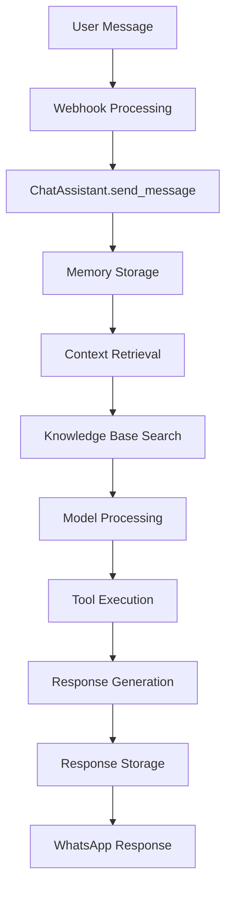

# WozapAuto AI Agent Architecture Documentation

## Overview

The WozapAuto AI Agent is a sophisticated conversational AI system built on LangChain v3 and LangGraph, designed to handle WhatsApp conversations with persistent memory, semantic search, and knowledge base integration. The agent follows the ReAct (Reasoning and Acting) framework, providing intelligent responses while maintaining conversation context across multiple interactions.

## Architecture Overview

### Core Components

```
┌─────────────────────────────────────────────────────────────┐
│                    WozapAuto AI Agent                       │
├─────────────────────────────────────────────────────────────┤
│  ┌─────────────────┐  ┌─────────────────┐  ┌──────────────┐ │
│  │   LangGraph     │  │   LangChain    │  │   Django     │ │
│  │   StateGraph    │  │   Core Tools   │  │   Database   │ │
│  └─────────────────┘  └─────────────────┘  └──────────────┘ │
├─────────────────────────────────────────────────────────────┤
│  ┌─────────────────┐  ┌─────────────────┐  ┌──────────────┐ │
│  │   Memory        │  │   Knowledge     │  │   WhatsApp    │ │
│  │   Service       │  │   Base Service  │  │   Integration│ │
│  └─────────────────┘  └─────────────────┘  └──────────────┘ │
└─────────────────────────────────────────────────────────────┘
```

## Detailed Component Analysis

### 1. ChatAssistant Class (`service.py`)

The main agent class that orchestrates the entire conversation flow.

#### Key Features:
- **Model Integration**: Uses Google's Gemini 2.5 Flash model
- **State Management**: Implements LangGraph's `State` schema with message history
- **Tool Integration**: Binds memory search tools to the model
- **Context Management**: Handles conversation context with message trimming
- **Knowledge Base Integration**: Searches user's knowledge base for relevant information

#### Architecture Flow:
```python
class ChatAssistant:
    def __init__(self, thread_id, system_instructions, user, agent, remote_jid):
        # Initialize model, memory service, tools, and workflow
        self.model = init_chat_model("gemini-2.5-flash", model_provider="google_genai")
        self.memory_service = MemoryService(self.checkpointer.thread)
        self.memory_tools = MemorySearchTool(self.memory_service)
        self.init_workflow()
    
    def send_message(self, message: str) -> AIMessage:
        # Process user message and return AI response
        # Includes memory storage, context retrieval, and knowledge base search
```

### 2. Memory Service (`memory_service.py`)

Handles persistent conversation memory with semantic search capabilities.

#### Features:
- **Semantic Search**: Uses sentence transformers for embedding-based message retrieval
- **Context Management**: Combines recent and semantically relevant messages
- **Embedding Generation**: Automatically generates embeddings for new messages
- **Memory Cleanup**: Manages memory by cleaning up old messages

#### Key Methods:
```python
class MemoryService:
    def add_message(self, message_type, content, metadata, token_usage):
        # Store message with embedding for semantic search
    
    def get_relevant_messages(self, query, limit, similarity_threshold):
        # Find semantically similar messages using cosine similarity
    
    def get_context_messages(self, query, include_recent, include_semantic):
        # Combine recent and semantic messages for context
```

### 3. Memory Tools (`memory_tools.py`)

LangChain-compatible tools for memory search operations.

#### Available Tools:
- **search_memory**: Search through conversation history
- **get_conversation_summary**: Get conversation statistics

```python
class MemorySearchTool:
    def search_memory(self, query: str, limit: int = 10) -> str:
        # Search conversation history using semantic similarity
    
    def get_conversation_summary(self) -> str:
        # Return conversation statistics and summary
```

### 4. Database Checkpointer (`checkpointer.py`)

Custom LangGraph checkpointer that persists conversation state to Django database.

#### Features:
- **State Persistence**: Saves conversation state to database
- **Thread Management**: Manages conversation threads per user/contact
- **Checkpoint Recovery**: Allows resuming conversations from saved state

### 5. Data Models (`models.py`)

Django models for persistent storage of conversations and agent data.

#### Key Models:
- **Agent**: Represents AI agents with system prompts and configurations
- **ConversationThread**: Manages conversation threads per user/contact
- **ConversationMessage**: Stores individual messages with embeddings
- **ConversationCheckpoint**: Stores LangGraph checkpoints for state management

## Execution Flow

### 1. Message Processing Flow



### 2. Context Assembly Process

1. **Recent Messages**: Retrieve last 5 messages for immediate context
2. **Semantic Search**: Find relevant historical messages using embeddings
3. **Knowledge Base**: Search user's knowledge base for relevant information
4. **Message Trimming**: Ensure context fits within model's token limits
5. **Prompt Assembly**: Combine system prompt, context, and user message

### 3. Tool Execution Flow

```python
def call_model_with_tools(self, state: State):
    # 1. Get context messages
    context_messages = self.memory_service.get_context_messages(...)
    
    # 2. Add knowledge base context
    kb_context = self.get_knowledge_base_context(...)
    
    # 3. Process with model
    response = self.model_with_tools.invoke(prompt)
    
    # 4. Execute tools if requested
    if response.tool_calls:
        for tool_call in response.tool_calls:
            tool_result = self.execute_tool(tool_call)
            # Add tool result to conversation
    
    # 5. Generate final response
    final_response = self.model_with_tools.invoke(final_prompt)
```

## Configuration and Setup

### Environment Variables
```bash
GOOGLE_API_KEY=your_google_api_key
LANGSMITH_TRACING=true
LANGSMITH_API_KEY=your_langsmith_key
```

### Database Requirements
- PostgreSQL with pgvector extension for vector operations
- Django models for conversation storage
- Vector embeddings for semantic search

### Model Configuration
- **Primary Model**: Google Gemini 2.5 Flash
- **Embedding Model**: all-MiniLM-L6-v2 (384 dimensions)
- **Fallback Models**: paraphrase-MiniLM-L6-v2, all-MiniLM-L12-v2

## Advanced Features

### 1. Semantic Memory Search
- Uses sentence transformers for embedding generation
- Cosine similarity for message retrieval
- Configurable similarity thresholds
- Automatic embedding updates for new messages

### 2. Knowledge Base Integration
- User-specific knowledge base search
- Configurable similarity thresholds
- Automatic context injection
- Chunk-based information retrieval

### 3. Token Usage Tracking
- Input/output token tracking per message
- Model usage statistics
- Cost monitoring and optimization
- Response time tracking

### 4. Conversation Management
- Thread-based conversation organization
- Automatic memory cleanup
- Checkpoint-based state management
- Multi-user conversation isolation

## Performance Optimizations

### 1. Message Trimming
- Token-based message trimming
- Configurable context window sizes
- Safety checks for large conversations
- Fallback mechanisms for trimming failures

### 2. Memory Management
- Automatic cleanup of old messages
- Embedding optimization
- Context window management
- Database query optimization

### 3. Error Handling
- Graceful degradation for missing services
- Fallback mechanisms for tool failures
- Comprehensive logging and monitoring
- User-friendly error messages

## Security and Privacy

### 1. User Isolation
- Per-user conversation threads
- Isolated memory and knowledge bases
- Secure webhook validation
- User authentication and authorization

### 2. Data Protection
- Encrypted message storage
- Secure API key management
- Audit logging for compliance
- Data retention policies

## Monitoring and Analytics

### 1. Conversation Analytics
- Message count tracking
- Token usage monitoring
- Response time analysis
- User engagement metrics

### 2. System Health
- Memory usage monitoring
- Database performance tracking
- Error rate monitoring
- Service availability checks

## Troubleshooting

### Common Issues

1. **Memory Service Failures**
   - Check embedding model availability
   - Verify database connectivity
   - Monitor memory usage

2. **Tool Execution Errors**
   - Validate tool definitions
   - Check model compatibility
   - Monitor tool performance

3. **Context Window Issues**
   - Adjust message trimming parameters
   - Monitor token usage
   - Optimize context retrieval

### Debugging Tools

- Comprehensive logging at all levels
- Memory usage statistics
- Token usage tracking
- Performance monitoring

## Future Enhancements

### Planned Improvements
1. **LangChain v3 Compliance**: Migrate to `create_agent()` function
2. **Advanced Tool Integration**: Add more sophisticated tools
3. **Multi-Modal Support**: Support for images and documents
4. **Real-time Streaming**: Implement streaming responses
5. **Advanced Analytics**: Enhanced conversation analytics

### Extension Points
- Custom tool development
- Model provider flexibility
- Advanced memory strategies
- Integration with external services

## Conclusion

The WozapAuto AI Agent represents a sophisticated implementation of conversational AI with persistent memory, semantic search, and knowledge base integration. While it follows many LangChain v3 patterns, there are opportunities to further align with the latest standards, particularly in the use of the `create_agent()` function and standardized tool execution patterns.

The architecture provides a solid foundation for scalable, intelligent conversations while maintaining user privacy and system performance.
